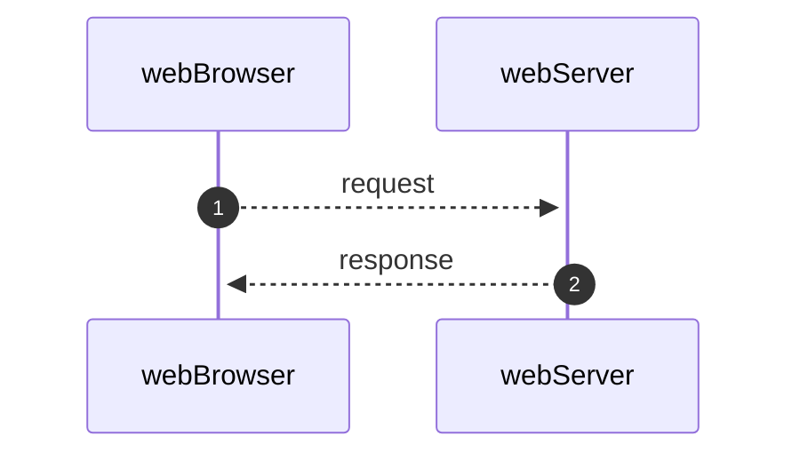

# 시퀀스 다이어그램


```mermaid
sequenceDiagram
  participant client as webBrowser
  participant server as webServer

autonumber
  client -->>+ server: request
  server -->>+ client: response
```

```java
public class HelloWorld {
    public static void main(String[] args) {
        System.out.println("Hello, world!");
    }
}
```